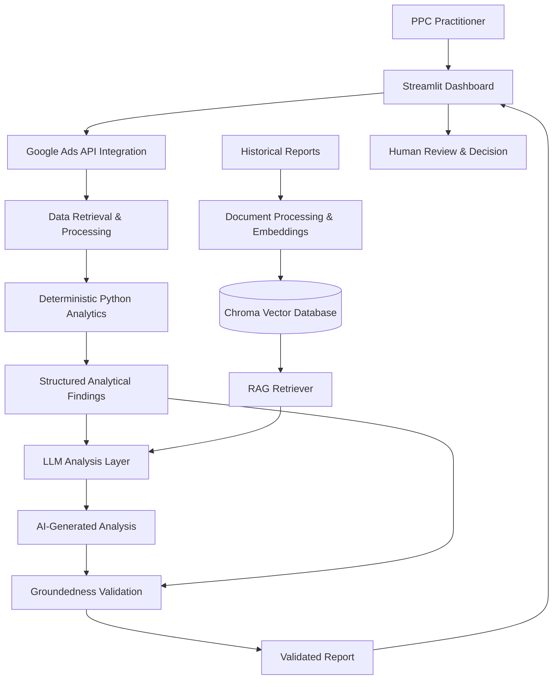
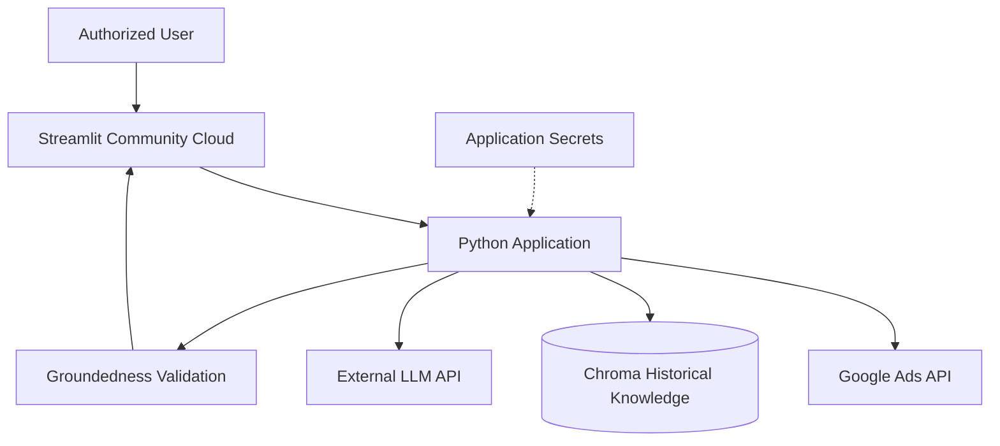

## System Architecture

### 1. Architecture Overview

Google Ads AI Analyst is an AI-powered advertising performance analysis and decision-support application.

The system follows a **deterministic-first, AI-second architecture**, separating numerical analysis from LLM-based interpretation.

Core advertising metrics are retrieved from the Google Ads API and processed using Python. Structured analytical findings are then enriched with relevant historical context through Retrieval-Augmented Generation (RAG). An LLM interprets the findings and generates human-readable insights, while a groundedness validation layer checks numerical claims against the underlying analytical evidence.

The application is designed as a **read-only decision-support system**. It identifies opportunities and potential performance problems without automatically modifying advertising campaigns.

### 2. High-Level Architecture



The architecture has seven main responsibilities:

1. Data acquisition
2. Data processing and deterministic analytics
3. Historical knowledge retrieval
4. LLM-powered interpretation
5. Groundedness validation
6. Report presentation
7. Human decision-making

### 3. Google Ads API Integration

**Purpose:** Retrieve advertising performance data directly from Google Ads.

The application authenticates using Google OAuth 2.0 and communicates with the Google Ads API.

Depending on the selected analysis, the integration retrieves information such as:

- Campaigns and ad groups
- Keywords and search terms
- Advertising cost and impressions
- Clicks and conversions
- Conversion value
- Device and geographical performance
- Daily performance trends
- Campaign-specific performance targets

The Google Ads API acts as the authoritative source for current advertising metrics.

**Design decision:** Live numerical data is retrieved from Google Ads rather than generated or estimated by an LLM.

### 4. Data Processing and Analytics Layer

**Purpose:** Transform raw advertising data into reliable, structured analytical findings.

This layer uses deterministic Python functions to calculate metrics and identify patterns.

#### Core Performance Metrics

| Metric | Calculation |
|---|---|
| Click-through rate (CTR) | Clicks / Impressions × 100 |
| Cost per click (CPC) | Cost / Clicks |
| Conversion rate (CVR) | Conversions / Clicks × 100 |
| Cost per acquisition (CPA) | Cost / Conversions |
| Return on ad spend (ROAS) | Conversion Value / Cost |

Calculations must handle missing values and zero denominators appropriately.

#### Performance Analysis

The analytics layer can identify findings such as:

- Campaigns operating above their configured target CPA
- High-cost search terms with no recorded conversions
- Campaigns with relatively strong conversion performance
- Performance differences across devices and locations
- Changes between reporting periods
- Areas requiring further investigation

Importantly, **zero conversions do not automatically mean wasted advertising spend**. The system should consider the available evidence and avoid presenting uncertain findings as definitive conclusions.

#### Campaign-Specific Target CPA

Instead of evaluating every campaign against a single account-level CPA benchmark, the analysis compares campaign performance against its own configured target where available.

This reflects differences in campaign objectives and acquisition-cost expectations.

**Design decision:** Python performs numerical calculations and rule-based detection because these operations should be deterministic, testable and reproducible.

### 5. Structured Findings Layer

**Purpose:** Convert numerical analysis into organized evidence that the LLM can interpret.

Rather than sending an unstructured collection of raw advertising records directly to the language model, the application prepares structured findings.

An illustrative finding might look like:

```json
{
  "campaign": "Example Campaign",
  "finding_type": "CPA_ABOVE_TARGET",
  "cost": 1000,
  "conversions": 10,
  "actual_cpa": 100,
  "target_cpa": 70,
  "status": "REQUIRES_REVIEW"
}
```

*The values above are illustrative, not live campaign data.*

This separation makes it easier to:

- Trace analytical conclusions to source data
- Reduce unnecessary LLM context
- Apply consistent business rules
- Validate generated numerical statements
- Test analytical logic independently of the LLM

### 6. Retrieval-Augmented Generation (RAG)

**Purpose:** Provide historical advertising context that is relevant to the current analysis.

The RAG layer complements live Google Ads data rather than replacing it.

#### 6.1 Historical Knowledge Indexing

Historical reports are prepared for semantic retrieval.

Conceptual indexing flow:

```text
Historical Reports
       |
       v
Document Preparation
       |
       v
Text Chunking
       |
       v
Embedding Generation
       |
       v
Chroma Vector Database
```

Each stored record can associate its vector embedding with the original text and relevant metadata.

Useful metadata includes:

- Customer or account identifier
- Campaign identifier
- Reporting period
- Finding category
- Report source

Metadata helps distinguish historical findings from different campaigns, customers and reporting periods.

#### 6.2 Historical Context Retrieval

When historical context is needed, the retrieval workflow is:

```text
Current Analytical Finding
          |
          v
     Retrieval Query
          |
          v
    Query Embedding
          |
          v
  Chroma Similarity Search
          |
          v
Relevant Historical Findings
          |
          v
       LLM Context
```

The retrieved material helps the LLM interpret whether a current issue resembles previously observed patterns.

For example, a campaign experiencing a high CPA may have similar findings in previous reports.

However, the system should describe an issue as recurring only when the historical evidence supports that conclusion.

#### 6.3 Retrieval Quality

RAG retrieval quality can be evaluated using a labelled set of queries and relevant documents.

Useful metrics include:

- **Precision@K:** The proportion of retrieved chunks that are relevant.
- **Recall@K:** The proportion of all relevant chunks successfully retrieved.
- **Context relevance:** Whether retrieved information helps answer the current analytical question.

Chunk size, overlap, retrieval depth and metadata filtering should be tuned using representative evaluation queries rather than assuming a single configuration is optimal.

**Design decision:** RAG provides updateable historical knowledge without requiring the language model to be retrained whenever a new advertising report becomes available.

### 7. LLM Interpretation Layer

**Purpose:** Translate analytical findings into understandable, actionable explanations.

The LLM receives:

1. Current structured analytical findings
2. Relevant historical context, when available
3. Instructions defining the required analysis and reporting behavior

The model is responsible for:

- Explaining detected performance patterns
- Prioritizing findings requiring investigation
- Describing potential causes as hypotheses rather than proven facts
- Suggesting follow-up investigations
- Producing human-readable technical and client-facing summaries

The model is **not responsible for calculating authoritative advertising metrics**.

This distinction is central to the system's reliability.

#### Why Use an LLM?

Traditional Python analytics can determine that a campaign's CPA is above its target.

An LLM adds value by explaining the significance of that finding, connecting it to relevant context and communicating possible next steps in natural language.

The architecture combines deterministic calculations with flexible language-based interpretation.

### 8. Groundedness Validation Layer

**Purpose:** Reduce unsupported numerical claims in AI-generated reports.

Even when an LLM receives accurate source data, it may generate incorrect figures or unsupported statements.

The application therefore includes a post-generation groundedness validation stage.

```text
Structured Source Findings
           |
           v
      LLM Generation
           |
           v
    Generated Report
           |
           v
  Numerical Claim Validation
           |
           v
   Validated Report / Flag
```

The validation process checks numerical statements in the generated report against the available structured findings.

For example:

**Source finding:**

```text
Actual CPA: $100
Target CPA: $70
```

**Unsupported generated claim:**

```text
The campaign CPA is $150.
```

The reported figure does not match the source evidence and should be flagged.

This validation improves the reliability of numerical reporting.

**Limitation:** Numerical groundedness checking does not guarantee that every qualitative conclusion is correct. Broader factual accuracy, retrieval relevance and recommendation quality require additional evaluation.

### 9. Streamlit Presentation Layer

**Purpose:** Provide an accessible interface for advertising analysis.

The application uses Streamlit to expose the analytical workflow through an interactive dashboard.

The interface supports the practitioner in reviewing advertising performance, inspecting findings and consuming AI-generated explanations.

Streamlit was selected because it enables rapid development and deployment of Python-based analytical applications.

The deployed application uses Streamlit Community Cloud, while the LLM is accessed through an external API.

This means the application does not need to host the underlying language model or operate dedicated model-serving GPU infrastructure.

### 10. Responsible AI and Human Oversight

Responsible AI considerations are incorporated into the application's design.

#### Human-in-the-Loop Decision Making

The application provides recommendations and analytical findings but does not automatically change campaign settings, bids, budgets or negative keywords.

The PPC practitioner remains responsible for deciding whether a recommendation should be implemented.

#### Numerical Reliability

Deterministic analytics and post-generation groundedness checks reduce dependence on unsupported LLM calculations.

#### Transparency

Findings should be connected to the underlying advertising evidence, allowing the practitioner to understand why an issue was identified.

#### Uncertainty

Potential performance issues are presented as findings requiring investigation rather than automatically asserting causation.

#### Data Access and Privacy

Google Ads credentials must be stored securely, and access to advertising accounts should be limited to authorized users.

### 11. Authentication and Security

The application uses OAuth 2.0 credentials to authenticate Google Ads API requests.

Sensitive configuration includes:

- Google Ads developer token
- OAuth Client ID
- OAuth Client Secret
- OAuth refresh token
- LLM API credentials

Secrets are managed separately from the public source code.

For Streamlit Community Cloud deployment, application secrets are configured through Streamlit's secret-management settings.

Sensitive credentials, OAuth files and local environment configuration must not be committed to Git.

### 12. Deployment Architecture



The deployment approach was selected for the application's initial internal decision-support use case.

The system does not require a self-hosted LLM because inference is performed through an external LLM provider.

### 13. Future Production Architecture

For a larger multi-user or multi-client deployment, the application could evolve into a service-oriented architecture.

Potential improvements include:

- **FastAPI backend:** Expose analytics, retrieval and reporting capabilities through structured API endpoints.
- **Docker:** Package backend services with their dependencies for consistent deployment.
- **Managed databases:** Store structured application data, reports and job status.
- **Background processing:** Run longer analyses asynchronously.
- **Persistent vector storage:** Provide reliable storage and lifecycle management for historical knowledge.
- **Authentication and authorization:** Enforce customer-level access boundaries.
- **Monitoring and tracing:** Track API failures, latency, LLM usage, retrieval behavior and validation failures.
- **Automated testing:** Test data processing, business rules, retrieval and generated report quality.
- **CI/CD:** Automate testing and deployment.
- **Container orchestration:** Consider Kubernetes if traffic, scaling and operational requirements justify it.

These are potential architectural improvements, not claims about the current deployment.

### 14. Design Principles

The system is built around five architectural principles:

**1. Deterministic-first, AI-second**

Use conventional Python logic for numerical calculations and measurable business rules. Use LLMs for interpretation and explanation.

**2. Evidence-grounded generation**

Supply structured source findings and relevant historical context rather than asking the model to invent or estimate performance information.

**3. Separation of responsibilities**

Keep data acquisition, analytics, retrieval, generation, validation and presentation as logically distinct responsibilities.

**4. Human-controlled decisions**

Use AI to support advertising practitioners without automatically making financial or campaign-management changes.

**5. Reliability over unnecessary complexity**

Select infrastructure and engineering approaches appropriate to the current application, while keeping a clear path toward more scalable production deployment.

### 15. End-to-End Execution Summary

```text
1. User selects an account, campaign or reporting period
                         |
                         v
2. Google Ads API retrieves current advertising data
                         |
                         v
3. Python validates and processes the retrieved records
                         |
                         v
4. Deterministic analytics produces structured findings
                         |
                         v
5. RAG retrieves relevant historical context if needed
                         |
                         v
6. LLM interprets and prioritizes the findings
                         |
                         v
7. Groundedness layer checks numerical claims
                         |
                         v
8. Streamlit displays the resulting analysis
                         |
                         v
9. PPC practitioner reviews findings and decides actions
```

**Google Ads AI Analyst demonstrates an approach to Applied AI engineering that combines API integration, deterministic analytics, RAG, LLM interpretation, validation and human oversight in a practical decision-support application.**
